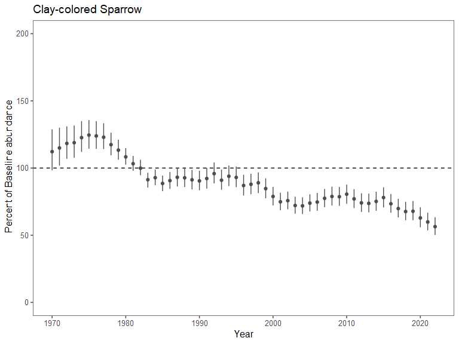

# Overview

This document outlines a proposed approach for setting interim
population goals for declining species. We seek to develop **SMART**
interim population goals:

-   ***S**pecific*: What needs to be accomplished? Who is responsible
    for it? What steps need to be taken to achieve it?

-   ***M**easurable*: Goals are stated in quantitative terms and based
    on indicators that are tracked through routine monitoring.

-   ***A**chievable*: Goals represent population recovery scenarios that
    would occur through sustained but incremental investment in
    conservation. The goals also recognize that fully recovering species
    that have experienced long-term declines is unrealistic in many
    cases.

-   ***R**elevant*: How do these goals relate to CWS/ECCC/GOC mandates?

-   ***T**ime-bound*: The time horizon represents the scale at which
    conservation action has the potential to achieve goals.

For each species that has experienced long-term population declines, we
construct two projection curves that represent alternative future
pathways populations could take:

1.  population declines continue at the same average rate as in the
    past, or

2.  populations achieve a specified positive population growth at a
    specified point in the future, where the curve is chosen to
    represent a plausible and achievable trajectory towards recovery.

As new monitoring data is collected in the future, progress towards
recovery can be measured by compared the observed population trajectory
to the projections.

# Method description & case study

We start by fitting a population model to monitoring data for a focal
species. We accomplish this using the `bbsBayes2` R package for species
monitored by the North American Breeding Bird Survey. We fit the ‘gamye’
version of the model, which uses hierarchical splines to model
curvilinear population trajectories, as well as random annual year
effects.

The code below fits the model for **Clay-colored Sparrow**:

``` r

species_name <- "Clay-colored Sparrow"

# 4 letter species abbreviation code
sp_code <- subset(ac, English_Name == species_name)$Species_ID

# Directory where fitted model will be stored 
filename <- paste0("fitted_models/",sp_code,".RDS")

# Fit model for this species, save resulting indices
if (!file.exists(filename)){
  
  # Stratify data
  s <- stratify(by = "bbs_usgs", species = species_name)
  
  p <- tryCatch(expr = {prepare_data(s)},
                error = function(e){NULL})
  
  # Fit model & generate indices
  if (is.null(p)) next
  p <- prepare_data(s)
  md <- prepare_model(p, model = "gamye")
  m <- run_model(md, save_model = FALSE)
  i <- generate_indices(model_output = m, regions = "country")
  
  # National indices
  samps <- i$samples$country_Canada
  
  # Save results
  sp_results <- list(samps = samps)
  saveRDS(sp_results, file = filename)
}

sp_results <- readRDS(filename)
```

Below, we plot the annual population indices for the species:


### Population projections

Population projections require several key inputs:

1.  **Historical trend**: An estimate of historical population trend,
    which describes the average rate of population change populations
    have experienced over the ‘long-term’. This is calculated directly
    from the population indices that are generated from Bayesian
    analysis of the dataset. \>\> test

2.  **Year in which goals are set**: This is the date at which the
    projection ‘begins’. After this date, progress towards recovery will
    be evaluated. In these

3.  **Target population trend**:

4.  

target_trend = 3,

                                # Years until target growth rate is reached
                                years_to_target_trend = 25, 
                                
                                # Final year of projection
                                end_of_projection = 2100,  
                                
                                # Years for calculating baseline index (average across these years)
                                baseline_years = seq(1980,1984), 

\[text goes here\]

Annual population indices can also be expressed as a percentage of a
historical baseline abundance. For the BBS, estimated indices prior to
1980 are potentially unreliable because the program was still expanding.
Thus, we use the **average estimated index for the 5-year period from
1980-1984 as a baseline**. The plot below illustrates the annual
indices, expressed as a percentage of the **mean index from 1980-1984**:



The following figure illustrates the estimated national annual indices
for the species.

# Application to all species

# Results summary

# R code

The R code below was used to conduct analyses for all species.

``` r

# ------------------------------------------
# Fit models for target species
# ------------------------------------------

trend_summary <- data.frame()

for (species_name in (target_species$Species)){
  
  print(species_name)
  sp_code <- subset(ac, English_Name == species_name)$Species_ID
  filename <- paste0("fitted_models/",sp_code,".RDS")
  
  # If projection has already been run, skip
  #if (file.exists(paste0("figures/",sp_code,"_Percent.png"))) next
  
  #if (!file.exists(filename)) next
  
  if (file.exists(filename)){
    
    sp_results <- readRDS(filename)
    
  } else {
    
    sp_exists <- bbsBayes2::search_species(species_name)
    if (nrow(sp_exists)<1) next
    
    s <- stratify(by = "bbs_usgs", species = species_name)
    p <- tryCatch(expr = {prepare_data(s)},
                  error = function(e){NULL})
    
    if (is.null(p)) next
    
    p <- prepare_data(s)
    md <- prepare_model(p, model = "gamye")
    m <- run_model(md, save_model = FALSE)
    i <- generate_indices(model_output = m, regions = "country")
    
    samps <- i$samples$country_Canada
    
    sp_results <- list(samps = samps)
    saveRDS(sp_results, file = paste0("fitted_models/",sp_code,".RDS"))
    
  }
  
  # --------------------------------------------------
  # Prepare estimates
  # --------------------------------------------------
  
  samps <- sp_results$samps
  year_seq <- colnames(samps) %>% as.numeric()
  samps <- samps[,which(year_seq >= 1970)]
  year_seq <- year_seq[which(year_seq >= 1970)]
  
  # --------------------------------------------------
  # Conduct population projections
  # --------------------------------------------------
  
  year_goals_are_set = 2022                                # Year in which goals are set
  target_trend = 3                                         # Percent change per year
  years_to_target_trend = 25                               # Years until target is reached
  end_of_projection = 2100                                 # Final year of projection
  baseline_years <- seq(1980,1984) #seq(min(year_seq),min(year_seq)+4)     # Years for calculating baseline abundance (average across these years)
  length_current_trend = year_goals_are_set-1980           # How far back to calculate "current" trend over
  
  # Properties of data/projection (don't need to be modified)
  final_year_of_data = max(year_seq)
  year_seq_projection <- seq(year_seq[1],end_of_projection)
  
  # Empty objects to store estimates
  samps_StatusQuo <- samps_Recovery <- samps_gam <- matrix(NA, nrow = nrow(samps), ncol = length(year_seq_projection))
  Index_baseline <- Trend_samples <- c()
  
  for (i in 1:nrow(samps)){
    
    # ---------------------------------------------
    # Extract estimated historical dynamics from bbs fit
    # ---------------------------------------------
    
    # Annual indices for this draw from the posterior
    i_dat <- data.frame(log_y = log(samps[i,]),Year = year_seq) %>% subset(Year <= final_year_of_data)
    
    # Knot every XX years
    knot_distance = 5
    knots <- seq(min(year_seq), max(year_seq)+10, knot_distance)
    gam <- gam(log_y~s(Year, bs = 'cs', k = length(knots)),
               knots = list(Year = knots),
               data = i_dat)
    
    #   # For plotting knot locations
    #   my_knots <- gam$smooth[[1]]$xp
    #   plot(i_dat$Year, i_dat$log_y, col= "grey", main = "my knots");
    #   lines(i_dat$Year, gam$linear.predictors, col = 2, lwd = 2)
    #   abline(v = my_knots, lty = 2)
    
    i_dat$gam_pred <- predict(gam, newdata = i_dat)
    
    samps_gam[i,1:length(i_dat$gam_pred)] <- exp(i_dat$gam_pred)
    
    # ---------------------------------------------
    # Estimate baseline abundance as average of initial 5 years of data
    # ---------------------------------------------
    Index_baseline[i] <- mean(exp(i_dat$gam_pred[i_dat$Year %in% baseline_years])) 
    
    # ---------------------------------------------
    # Trend estimate as average annual log-scale difference in index
    # ---------------------------------------------
    
    i_dat_for_trend <- subset(i_dat, Year %in% seq(year_goals_are_set,year_goals_are_set - length_current_trend))
    trend_log <- mean(diff(i_dat_for_trend$gam_pred))
    trend_percent <- 100*(exp(trend_log)-1) # Convert to percent change per year
    
    # Save estimate of trend
    Trend_samples <- c(Trend_samples,trend_log)
    
    # ---------------------------------------------
    # Conduct future projections under:
    #    1) status quo
    #    2) achieving target trajectory
    # ---------------------------------------------
    
    projection_i <- data.frame(Year = year_seq_projection,
                               y_Obs = NA,
                               y_StatusQuo = NA,
                               y_Recovery = NA)
    
    # Observed indices
    projection_i$y_Obs[projection_i$Year %in% i_dat$Year] <- exp(i_dat$log_y)
    projection_i$y_gam[projection_i$Year %in% i_dat$Year] <- exp(i_dat$gam_pred)
    
    projection_i <- subset(projection_i, Year >= (year_goals_are_set - length_current_trend))
    
    # **********************
    # Historical trend (duplicate it for StatusQuo and Recovery scenarios; past is the same regardless)
    # **********************
    
    projection_i$y_StatusQuo[1] <- projection_i$y_gam[1]
    projection_i$y_Recovery[1] <- projection_i$y_gam[1]
    
    for (y in seq((min(projection_i$Year)+1),year_goals_are_set)){
      projection_i$y_StatusQuo[projection_i$Year == y] <- projection_i$y_StatusQuo[projection_i$Year == (y-1)] *  exp(trend_log)
      projection_i$y_Recovery[projection_i$Year == y] <- projection_i$y_Recovery[projection_i$Year == (y-1)] *  exp(trend_log)
    }
    
    # **********************
    # Project StatusQuo into the future
    # **********************
    
    for (y in seq(year_goals_are_set+1,end_of_projection)){
      projection_i$y_StatusQuo[projection_i$Year == y] <- projection_i$y_StatusQuo[projection_i$Year == (y-1)] *  exp(trend_log)
    }
    
    # **********************
    # Project Recovery into the future
    # **********************
    
    # Sequence of future annual growth rates
    trend_seq <- c(seq(trend_percent,target_trend,length.out = years_to_target_trend+1),rep(target_trend,1000))
    proj_years <- seq(year_goals_are_set,end_of_projection)
    trend_seq <- trend_seq[1:length(proj_years)]
    trend_seq_logscale <- log(trend_seq/100 + 1) # Put target trend on log scale for easier math
    
    for (y in seq(year_goals_are_set+1,end_of_projection)){
      projection_i$y_Recovery[projection_i$Year == y] <- projection_i$y_Recovery[projection_i$Year == (y-1)] *  exp(trend_seq_logscale[proj_years == y])
    }
    
    samps_StatusQuo[i,which(year_seq_projection %in% projection_i$Year)] <- projection_i$y_StatusQuo
    samps_Recovery[i,which(year_seq_projection %in% projection_i$Year)] <- projection_i$y_Recovery
    samps_gam[i,1:length(i_dat$gam_pred)] <- exp(i_dat$gam_pred)
    
  }
  
  # ----------------------------------------------------
  # Round estimates/projections to 3 decimal places
  # ----------------------------------------------------
  
  samps_gam <- round(samps_gam,3)
  samps_StatusQuo <- round(samps_StatusQuo,3)
  samps_Recovery <- round(samps_Recovery,3)
  
  # ----------------------------------------------------
  # Summarize indices each year
  # ----------------------------------------------------
  
  indices_summarized <- samps %>%
    reshape2::melt() %>%
    group_by(year) %>%
    summarize(Index_q_0.025 = quantile(value,0.025),
              Index = quantile(value,0.5),
              Index_q_0.975 = quantile(value,0.975)) %>%
    dplyr::rename(Year = year)
  
  # ----------------------------------------------------
  # Estimates of current status relative to projection scenarios and
  # historical abundance
  # ----------------------------------------------------
  
  status_year_number <- which(year_seq_projection == final_year_of_data)
  
  Prob_Exceed_StatusQuo <- 100*mean(samps_gam[,status_year_number] > samps_StatusQuo[,status_year_number]) %>% round(3)
  Prob_Exceed_Recovery <- 100*mean(samps_gam[,status_year_number] > samps_Recovery[,status_year_number]) %>% round(3)
  Prob_Exceed_1970 <- 100*mean(samps_gam[,status_year_number] > samps_gam[,1]) %>% round(3)
  
  # ---------------------------------------------------------------------
  # Plot population dynamics (expressed as raw indices - not percent of 1970 level)
  # ---------------------------------------------------------------------
  
  StatusQuo_summary <- reshape2::melt(samps_StatusQuo) %>%
    rename(samp = Var1, year_number = Var2, StatusQuo = value) %>%
    mutate(Year = year_seq_projection[year_number]) %>%
    group_by(Year) %>%
    summarize(StatusQuo_med = median(StatusQuo),
              StatusQuo_q_0.025 = quantile(StatusQuo,0.025, na.rm = TRUE),
              StatusQuo_q_0.975 = quantile(StatusQuo,0.975, na.rm = TRUE))
  
  Recovery_summary <- reshape2::melt(samps_Recovery) %>%
    rename(samp = Var1, year_number = Var2, Recovery = value) %>%
    mutate(Year = year_seq_projection[year_number]) %>%
    group_by(Year) %>%
    summarize(Recovery_med = median(Recovery),
              Recovery_q_0.025 = quantile(Recovery,0.025, na.rm = TRUE),
              Recovery_q_0.975 = quantile(Recovery,0.975, na.rm = TRUE))
  
  gam_summary <- reshape2::melt(samps_gam) %>%
    rename(samp = Var1, year_number = Var2, gam = value) %>%
    mutate(Year = year_seq_projection[year_number]) %>%
    group_by(Year) %>%
    summarize(gam_med = median(gam, na.rm = TRUE),
              gam_q_0.025 = quantile(gam,0.025, na.rm = TRUE),
              gam_q_0.975 = quantile(gam,0.975, na.rm = TRUE))
  
  projection_plot <- ggplot()+
    
    geom_vline(xintercept = year_goals_are_set, size=2, col = "black", alpha = 0.2)+
    geom_text(aes(x = year_goals_are_set+1, y = 0.01), 
              label = "<- Year goals were set", col = "black", alpha = 0.2,
              hjust=0, fontface = "bold", size = 2)+
    
    geom_ribbon(data = StatusQuo_summary, aes(x = Year, ymin = StatusQuo_q_0.025, ymax = StatusQuo_q_0.975), alpha = 0.2, fill = "orangered")+
    geom_line(data = StatusQuo_summary, aes(x = Year, y = StatusQuo_med), col = "orangered", linewidth = 1)+
    
    geom_ribbon(data = subset(Recovery_summary, Year >= year_goals_are_set), aes(x = Year, ymin = Recovery_q_0.025, ymax = Recovery_q_0.975), alpha = 0.2, fill = "dodgerblue")+
    geom_line(data = subset(Recovery_summary, Year >= year_goals_are_set), aes(x = Year, y = Recovery_med), col = "dodgerblue", linewidth = 1)+
    
    geom_ribbon(data = gam_summary, aes(x = Year, ymin = gam_q_0.025, ymax = gam_q_0.975), alpha = 0.4, fill = "gray50")+
    geom_line(data = gam_summary, aes(x = Year, y = gam_med), col = "gray50", linewidth = 1)+
    
    # Observed indices
    geom_errorbar(data = subset(indices_summarized, Year >= 1970 & Year <= final_year_of_data),aes(x = Year, ymin = Index_q_0.025, ymax = Index_q_0.975), width = 0, col = "gray30")+
    geom_point(data = subset(indices_summarized, Year >= 1970  & Year <= final_year_of_data),aes(x = Year, y = Index), col = "gray30")+
    
    ylab("Population Index")+
    xlab("Year")+
    theme_few()+
    ggtitle(species_name)+
    labs(subtitle = paste0("\nCurrent Status (",final_year_of_data,"):\n\n",
                           "Exceeds status quo trajectory: ",Prob_Exceed_StatusQuo,"% chance\n",
                           "Exceeds recovery trajectory: ",Prob_Exceed_Recovery,"% chance\n",
                           "Exceeds 1970 abundance: ",Prob_Exceed_1970,"% chance\n"))+
    coord_cartesian(ylim=c(0,max(apply(samps,2,function(x) quantile(x, 0.975)))))+
    scale_x_continuous(breaks = seq(1970,end_of_projection,10))
  
  print(projection_plot)
  
  png(filename = paste0("figures/",sp_code,"_Indices.png"), width = 6, height = 6, units = "in", res = 600)
  print(projection_plot)
  dev.off()
  
  # ---------------------------------------------------------------------
  # Plot dynamics expressed as percent of baseline level
  # ---------------------------------------------------------------------
  
  percent_of_1970_StatusQuo <- samps_StatusQuo
  percent_of_1970_Recovery <- samps_Recovery
  
  for (j in 1:ncol(percent_of_1970_StatusQuo)){
    percent_of_1970_StatusQuo[,j] <- 100* percent_of_1970_StatusQuo[,j]/Index_baseline
    percent_of_1970_Recovery[,j] <- 100* percent_of_1970_Recovery[,j]/Index_baseline
  }
  
  percent_of_1970_Obs <- samps
  for (j in 1:ncol(percent_of_1970_Obs)){
    percent_of_1970_Obs[,j] <- 100* percent_of_1970_Obs[,j]/Index_baseline
  }
  
  # Summarize
  percent_change_summary_Obs <- reshape2::melt(percent_of_1970_Obs) %>%
    rename(Year = year, Obs = value) %>%
    group_by(Year) %>%
    summarize(Obs_med = median(Obs),
              Obs_q_0.025 = quantile(Obs,0.025, na.rm = TRUE),
              Obs_q_0.975 = quantile(Obs,0.975, na.rm = TRUE))
  
  percent_change_summary_StatusQuo <- reshape2::melt(percent_of_1970_StatusQuo) %>%
    rename(samp = Var1, year_number = Var2, StatusQuo = value) %>%
    mutate(Year = year_seq_projection[year_number]) %>%
    group_by(Year) %>%
    summarize(StatusQuo_med = median(StatusQuo),
              StatusQuo_q_0.025 = quantile(StatusQuo,0.025, na.rm = TRUE),
              StatusQuo_q_0.975 = quantile(StatusQuo,0.975, na.rm = TRUE))
  
  percent_change_summary_Recovery <- reshape2::melt(percent_of_1970_Recovery) %>%
    rename(samp = Var1, year_number = Var2, Recovery = value) %>%
    mutate(Year = year_seq_projection[year_number]) %>%
    group_by(Year) %>%
    summarize(Recovery_med = median(Recovery),
              Recovery_q_0.025 = quantile(Recovery,0.025, na.rm = TRUE),
              Recovery_q_0.975 = quantile(Recovery,0.975, na.rm = TRUE))
  
  percent_change_plot <- ggplot()+
    
    # Year goals were set:
    geom_vline(xintercept = year_goals_are_set, size=2, col = "black", alpha = 0.2)+
    geom_text(aes(x = year_goals_are_set+1, y = 0), 
              label = "<- Year goals were set", col = "black", alpha = 0.2,
              hjust=0, fontface = "bold", size = 2)+
    
    # 100%
    geom_hline(yintercept = 100, linetype = 2)+
    
    
    # Observed indices
    geom_errorbar(data = subset(percent_change_summary_Obs,Year <= final_year_of_data), aes(x = Year, ymin = Obs_q_0.025, ymax = Obs_q_0.975), width = 0, col = "gray30")+
    geom_point(data = subset(percent_change_summary_Obs, Year <= final_year_of_data), aes(x = Year, y = Obs_med), col = "gray30")+
    
    # Historical trend
    geom_ribbon(data = subset(percent_change_summary_StatusQuo, Year <= year_goals_are_set), 
                aes(x = Year, 
                    ymin = StatusQuo_q_0.025, 
                    ymax = StatusQuo_q_0.975,
                    fill = "Historical"), alpha = 0.2)+
    geom_line(data = subset(percent_change_summary_StatusQuo, Year <= year_goals_are_set), 
              aes(x = Year, y = StatusQuo_med,
                  col = "Historical"), size = 1)+
    
    
    # StatusQuo
    geom_ribbon(data = subset(percent_change_summary_StatusQuo, Year >= year_goals_are_set), 
                aes(x = Year, 
                    ymin = StatusQuo_q_0.025, 
                    ymax = StatusQuo_q_0.975,
                    fill = "Status Quo"), 
                alpha = 0.2)+
    geom_line(data = subset(percent_change_summary_StatusQuo, Year >= year_goals_are_set), 
              aes(x = Year, y = StatusQuo_med, col = "Status Quo"), size = 1)+
    
    # Recovery
    geom_ribbon(data = subset(percent_change_summary_Recovery, Year >= year_goals_are_set), 
                aes(x = Year, 
                    ymin = Recovery_q_0.025, 
                    ymax = Recovery_q_0.975,
                    fill = "Recovery Target"), 
                alpha = 0.2)+
    geom_line(data = subset(percent_change_summary_Recovery, Year >= year_goals_are_set), 
              aes(x = Year, y = Recovery_med, col = "Recovery Target"), size = 1)+
    
    scale_x_continuous(breaks = seq(1970,end_of_projection,10))+
    
    scale_fill_manual(values=c("gray50","dodgerblue","orangered"), name = "Scenario")+
    scale_color_manual(values=c("black","dodgerblue","orangered"), name = "Scenario")+
    
    ylab("Percent of Baseline abundance")+
    xlab("Year")+
    ggtitle(species_name)+
    coord_cartesian(ylim=c(0,200))+
    labs(subtitle = paste0("\nCurrent Status (",final_year_of_data,"):\n\n",
                           "Exceeds status quo trajectory: ",Prob_Exceed_StatusQuo,"% chance\n",
                           "Exceeds recovery trajectory: ",Prob_Exceed_Recovery,"% chance\n",
                           "Exceeds Baseline abundance: ",Prob_Exceed_1970,"% chance\n"))+
    theme_few()
  
  print(percent_change_plot)
  
  png(filename = paste0("figures/",sp_code,"_Percent.png"), width = 8, height = 6, units = "in", res = 600)
  print(percent_change_plot)
  dev.off()
  
  # Trend goal for recovery trajectory
  recovery_trend_goal <- log(3/100 + 1)
  
  # Save estimates of species trend
  trend_summary <- rbind(trend_summary,
                         data.frame(Species = species_name,
                                    Trend_q.025 = quantile(Trend_samples,0.025),
                                    Trend_q.500 = quantile(Trend_samples,0.500),
                                    Trend_q.975 = quantile(Trend_samples,0.975),
                                    Prob_Trend_Lower_Than_Recovery_Goal = mean(Trend_samples <= -recovery_trend_goal)))
}
```

## Citations

R Core Team (2021). R: A language and environment for statistical
computing. R Foundation for Statistical Computing, Vienna, Austria.
